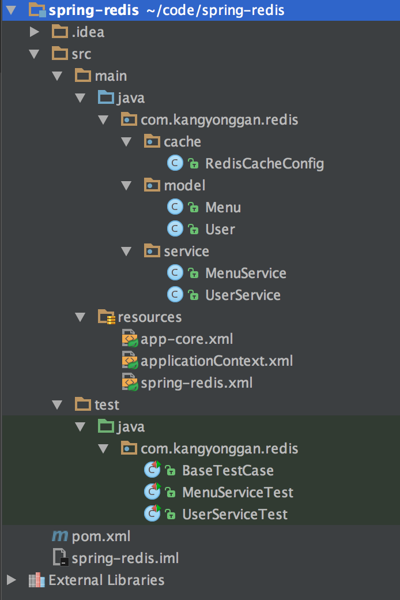

# spring整合redis实现无侵入式的管理缓存

> 使用spring缓存相关的注解， 并且结合redis， 达到无侵入式的缓存管理， 下面我将用一个demo演示怎样去实现...

## 项目整体结构



大家先看一下项目的整体结构， 暂时不要去纠结具体内容， 在需要的时候我会把内容贴出来

## 添加依赖

要想使用`spring`、`redis`，首先一定是要添加相关依赖， 为了测试方便我又添加了`junit`，为了代码简明我还添加了`lombok`

`pom.xml`完整内容:

```
<?xml version="1.0" encoding="UTF-8"?>
<project xmlns="http://maven.apache.org/POM/4.0.0"
         xmlns:xsi="http://www.w3.org/2001/XMLSchema-instance"
         xsi:schemaLocation="http://maven.apache.org/POM/4.0.0 http://maven.apache.org/xsd/maven-4.0.0.xsd">
    <modelVersion>4.0.0</modelVersion>

    <groupId>com.kangyonggan</groupId>
    <artifactId>spring-redis</artifactId>
    <version>1.0-SNAPSHOT</version>

    <properties>
        <junit.version>4.9</junit.version>
        <!--spring-->
        <spring.version>4.2.5.RELEASE</spring.version>
        <!--redis-->
        <spring-data-redis.version>1.3.2.RELEASE</spring-data-redis.version>
        <jedis.version>2.4.2</jedis.version>
        <!--lombok-->
        <lombok.version>1.16.8</lombok.version>
    </properties>

    <dependencies>
        <!--junit-->
        <dependency>
            <groupId>junit</groupId>
            <artifactId>junit</artifactId>
            <version>${junit.version}</version>
        </dependency>

        <!-- Spring -->
        <dependency>
            <groupId>org.springframework</groupId>
            <artifactId>spring-core</artifactId>
            <version>${spring.version}</version>
        </dependency>
        <dependency>
            <groupId>org.springframework</groupId>
            <artifactId>spring-beans</artifactId>
            <version>${spring.version}</version>
        </dependency>
        <dependency>
            <groupId>org.springframework</groupId>
            <artifactId>spring-context</artifactId>
            <version>${spring.version}</version>
        </dependency>
        <dependency>
            <groupId>org.springframework</groupId>
            <artifactId>spring-context-support</artifactId>
            <version>${spring.version}</version>
        </dependency>
        <dependency>
            <groupId>org.springframework</groupId>
            <artifactId>spring-aop</artifactId>
            <version>${spring.version}</version>
        </dependency>
        <dependency>
            <groupId>org.springframework</groupId>
            <artifactId>spring-test</artifactId>
            <version>${spring.version}</version>
        </dependency>

        <!-- redis -->
        <dependency>
            <groupId>org.springframework.data</groupId>
            <artifactId>spring-data-redis</artifactId>
            <version>${spring-data-redis.version}</version>
        </dependency>
        <dependency>
            <groupId>redis.clients</groupId>
            <artifactId>jedis</artifactId>
            <version>${jedis.version}</version>
        </dependency>
        <!--lombok-->
        <dependency>
            <groupId>org.projectlombok</groupId>
            <artifactId>lombok</artifactId>
            <version>${lombok.version}</version>
            <scope>provided</scope>
        </dependency>
    </dependencies>
</project>
```

## reids相关配置

为了演示方便，我就不用`properties`或者`autoconfig`之类的了

`spring-redis.xml`完整内容：

```
<?xml version="1.0" encoding="UTF-8"?>
<beans xmlns="http://www.springframework.org/schema/beans"
       xmlns:p="http://www.springframework.org/schema/p"
       xmlns:xsi="http://www.w3.org/2001/XMLSchema-instance"
       xsi:schemaLocation="http://www.springframework.org/schema/beans
		http://www.springframework.org/schema/beans/spring-beans-4.0.xsd">

    <bean id="poolConfig" class="redis.clients.jedis.JedisPoolConfig">
        <property name="maxTotal" value="1000"/>
        <property name="minIdle" value="50"/>
        <property name="maxIdle" value="100"/>
        <property name="testOnBorrow" value="true"/>
    </bean>

    <bean id="jedisConnectionFactory" class="org.springframework.data.redis.connection.jedis.JedisConnectionFactory"
          p:hostName="127.0.0.1" p:port="6379" p:password="123456" p:poolConfig-ref="poolConfig"/>

    <bean id="redisTemplate" class="org.springframework.data.redis.core.RedisTemplate">
        <property name="connectionFactory" ref="jedisConnectionFactory"/>
        <!-- 如果不配置Serializer，那么存储的时候智能使用String，如果用User类型存储，那么会提示错误User can't cast to String！！！ -->
        <property name="keySerializer">
            <bean class="org.springframework.data.redis.serializer.StringRedisSerializer" />
        </property>
        <property name="valueSerializer">
            <bean class="org.springframework.data.redis.serializer.JdkSerializationRedisSerializer"/>
        </property>
    </bean>

    <bean id="redisCacheManager" class="org.springframework.data.redis.cache.RedisCacheManager">
        <constructor-arg ref="redisTemplate" />
    </bean>

	 <!--自定义缓存配置-->
    <bean id="redisCacheConfig" class="com.kangyonggan.redis.cache.RedisCacheConfig">
        <constructor-arg ref="jedisConnectionFactory" />
        <constructor-arg ref="redisTemplate" />
        <constructor-arg ref="redisCacheManager" />
    </bean>
</beans>
```

## 自定义缓存配置

`RedisCacheConfig`完整内容:

```
package com.kangyonggan.redis.cache;

import org.springframework.cache.annotation.CachingConfigurerSupport;
import org.springframework.cache.annotation.EnableCaching;
import org.springframework.context.annotation.Configuration;
import org.springframework.data.redis.cache.RedisCacheManager;
import org.springframework.data.redis.connection.jedis.JedisConnectionFactory;
import org.springframework.data.redis.core.RedisTemplate;

/**
 * @author kangyonggan
 * @since 2016/10/16
 */
@Configuration
@EnableCaching
public class RedisCacheConfig extends CachingConfigurerSupport {

    private JedisConnectionFactory jedisConnectionFactory;

    private RedisTemplate redisTemplate;

    private RedisCacheManager redisCacheManager;

    public RedisCacheConfig(JedisConnectionFactory jedisConnectionFactory, RedisTemplate redisTemplate, RedisCacheManager redisCacheManager) {
        this.jedisConnectionFactory = jedisConnectionFactory;
        this.redisTemplate = redisTemplate;
        this.redisCacheManager = redisCacheManager;
    }

}
```

有需要的话， 可以重新定义`key`的生成策略， 覆写`keyGenerator`方法即可。

## 使用注解， 让代码无侵入

为了演示方便， 这里就不面向接口了

`UserService`完整内容:

```
package com.kangyonggan.redis.service;

import com.kangyonggan.redis.model.User;
import org.springframework.cache.annotation.CacheEvict;
import org.springframework.cache.annotation.Cacheable;
import org.springframework.stereotype.Service;

/**
 * @author kangyonggan
 * @since 16/10/16
 */
@Service
public class UserService {

    /**
     * 根据用户ID查找用户信息
     *
     * @param id
     * @return
     */
    @Cacheable(value = "user", key = "'user_id_' + #id")
    public User findUserById(Long id) {
        System.out.println("findUserById:" + id);
        return new User();
    }

    /**
     * 更新用户
     *
     * @param user
     */
    @CacheEvict(value = "user", key = "'user_id_'+#user.getId()")
    public void updateUser(User user) {
        System.out.println("updateUser:" + user);
    }

    /**
     * 删除用户
     *
     * @param id
     */
    @CacheEvict(value = "user", key = "'user_id_'+#id")
    public void deleteUser(Long id) {
        System.out.println("deleteUser:" + id);
    }

    /**
     * 清空用户相关缓存
     */
    @CacheEvict(value = "user", allEntries = true)
    public void clearUserCache() {
        System.out.println("clearUserCache");
    }
}
```

关于`@Cacheable`和`@CacheEvict`请自行百度，这里只是整合！

其中用到了`User`， 其完整代码：

```
package com.kangyonggan.redis.model;

import lombok.Data;

import java.io.Serializable;

/**
 * @author kangyonggan
 * @since 16/10/16
 */
@Data
public class User implements Serializable {

    private Long id;

}
```

> 注意：User类要实现序列化

其中`@Data`用来在字节码中生成getter、setter、toString、hashCode等， 我用的是IntelliJ IDEA编译器，需要安装lombok插件， lombok相关知识请自行百度。

其中`@Service`用的是spring的ioc， 所以需要添加spring相关配置， `applicationContext.xml`完整内容:

```
<?xml version="1.0" encoding="UTF-8"?>
<beans xmlns="http://www.springframework.org/schema/beans"
       xmlns:xsi="http://www.w3.org/2001/XMLSchema-instance"
       xmlns:context="http://www.springframework.org/schema/context"
       xsi:schemaLocation="http://www.springframework.org/schema/beans
		http://www.springframework.org/schema/beans/spring-beans-4.0.xsd
		http://www.springframework.org/schema/context
		http://www.springframework.org/schema/context/spring-context-4.0.xsd">

    <!-- Activates annotation-based bean configuration -->
    <context:annotation-config/>

    <!-- Scans for application @Components to deploy -->
    <context:component-scan base-package="com.kangyonggan.redis"/>

</beans>
```

## 测试

`UserServiceTest`完整内容:

```
package com.kangyonggan.redis;

import com.kangyonggan.redis.model.User;
import com.kangyonggan.redis.service.UserService;
import org.junit.Test;
import org.springframework.beans.factory.annotation.Autowired;

/**
 * @author kangyonggan
 * @since 2016/10/16
 */
public class UserServiceTest extends BaseTestCase {

    @Autowired
    private UserService userService;

    @Test
    public void testClearCache() {
        log("==========testClearCache==========");

        userService.clearUserCache();

        log("==========testClearCache==========");
    }

    /**
     * 测试查找用户
     */
    @Test
    public void testFindUserById() {
        log("==========testFindUserById==========");

        userService.findUserById(317L);

        userService.findUserById(318L);

        log("==========testFindUserById==========");
    }

    /**
     * 测试删除用户
     */
    @Test
    public void testDeleteUser() {
        log("==========testDeleteUser==========");

        userService.deleteUser(317L);

        log("==========testDeleteUser==========");
    }

    /**
     * 测试更新用户
     */
    @Test
    public void testUpdateUser() {
        log("==========testUpdateUser==========");

        User user = new User();
        user.setId(317L);

        userService.updateUser(user);

        log("==========testUpdateUser==========");
    }

    /**
     * 输出日志
     *
     * @param object
     */
    private void log(Object object) {
        System.out.println(object);
    }

}
```

其中`BaseTestCase`的完整内容:

```
package com.kangyonggan.redis;

import org.junit.runner.RunWith;
import org.springframework.test.context.ContextConfiguration;
import org.springframework.test.context.junit4.AbstractJUnit4SpringContextTests;
import org.springframework.test.context.junit4.SpringJUnit4ClassRunner;

/**
 * @author kangyonggan
 * @since 2016/10/16
 */
@ContextConfiguration(locations = {"classpath:app-core.xml"})
@RunWith(SpringJUnit4ClassRunner.class)
public class BaseTestCase extends AbstractJUnit4SpringContextTests {

}
```

其中`app-core.xml`的完整内容:

```
<?xml version="1.0" encoding="UTF-8"?>
<beans xmlns="http://www.springframework.org/schema/beans"
       xmlns:xsi="http://www.w3.org/2001/XMLSchema-instance"
       xsi:schemaLocation="http://www.springframework.org/schema/beans
		http://www.springframework.org/schema/beans/spring-beans-4.0.xsd">

    <!--spring公共配置-->
    <import resource="applicationContext.xml"/>
    <!--redis缓存配置-->
    <import resource="spring-redis.xml"/>

</beans>
```

## 说明
如果用户经常有改动， 那么在分页查询用户信息时就不要加入缓存， 因为一旦添加了新用户就要去清空缓存， 这样可能会得不偿失， 因此我这里分页查询用户就没加缓存（所以代码也没贴）。当然，也有一些不经常改动的， 比如菜单， 我会在下面的例子中贴出如何管理此类缓存。

`MenuService`完整内容:

```
package com.kangyonggan.redis.service;

import com.kangyonggan.redis.model.Menu;
import org.springframework.cache.annotation.CacheEvict;
import org.springframework.cache.annotation.Cacheable;
import org.springframework.stereotype.Service;

import java.util.List;

/**
 * @author kangyonggan
 * @since 16/10/16
 */
@Service
public class MenuService {

    /**
     * 添加菜单
     *
     * @param menu
     */
    @CacheEvict(value = "menu", allEntries = true)
    public void saveMenu(Menu menu) {
        System.out.println("saveMenu:" + menu);
    }

    /**
     * 根据菜单ID查找菜单信息
     *
     * @param id
     * @return
     */
    @Cacheable(value = "menu", key = "'menu_id_' + #id")
    public Menu findMenuById(Long id) {
        System.out.println("findMenuById:" + id);
        return new Menu();
    }

    /**
     * 根据菜单ID查找菜单信息
     *
     * @param pageNum
     * @return
     */
    @Cacheable(value = "menu", key = "'menus_p_' + #pageNum")
    public List<Menu> findMenuByPage(int pageNum) {
        System.out.println("findMenuByPage:" + pageNum);

        return null;
    }

    /**
     * 更新菜单
     *
     * @param menu
     */
    @CacheEvict(value = {"menu"}, allEntries = true)
    public void updateMenu(Menu menu) {
        System.out.println("updateMenu:" + menu);
    }

    /**
     * 删除菜单
     *
     * @param id
     */
    @CacheEvict(value = "menu", allEntries = true)
    public void deleteMenu(Long id) {
        System.out.println("deleteMenu:" + id);
    }

    /**
     * 清空菜单缓存
     */
    @CacheEvict(value = "menu", allEntries = true)
    public void clearMenuCache() {
        System.out.println("clearMenuCache");
    }

}
```

其中用到的`Menu`完整内容:

```
package com.kangyonggan.redis.model;

import lombok.Data;

import java.io.Serializable;

/**
 * @author kangyonggan
 * @since 2016/10/16
 */
@Data
public class Menu implements Serializable {

    private Long id;

}
```

测试类`MenuServiceTest`的完整内容:

```
package com.kangyonggan.redis;

import com.kangyonggan.redis.service.MenuService;
import org.junit.Test;
import org.springframework.beans.factory.annotation.Autowired;

/**
 * @author kangyonggan
 * @since 2016/10/16
 */
public class MenuServiceTest extends BaseTestCase {

    @Autowired
    private MenuService menuService;

    @Test
    public void testClearCache() {
        log("==========testClearCache==========");

        menuService.clearMenuCache();

        log("==========testClearCache==========");
    }

    /**
     * 测试查找菜单
     */
    @Test
    public void testFindMenuById() {
        log("==========testFindMenuById==========");

        menuService.findMenuById(417L);

        menuService.findMenuById(418L);

        log("==========testFindMenuById==========");
    }

    /**
     * 测试查找菜单
     */
    @Test
    public void testFindMenuByPage() {
        log("==========testFindMenuByPage==========");

        menuService.findMenuByPage(2);

        menuService.findMenuByPage(2);

        log("==========testFindMenuByPage==========");
    }

    /**
     * 测试查找菜单
     */
    @Test
    public void testDeleteMenu() {
        log("==========testDeleteMenu==========");

        menuService.deleteMenu(234L);

        log("==========testDeleteMenu==========");
    }

    /**
     * 输出日志
     *
     * @param object
     */
    private void log(Object object) {
        System.out.println(object);
    }

}
```

## 总结
spring整合redis实现无侵入式的管理缓存，分为以下几个步骤：

1. 添加依赖
2. 配置spring和redis
3. 实现自定义缓存配置
4. @Cacheable对结果进行缓存
5. @CacheEvict删除缓存

## 附录
Github项目完整代码:[https://github.com/kangyonggan/spring-redis.git](https://github.com/kangyonggan/spring-redis.git)

```
git clone https://github.com/kangyonggan/spring-redis.git
```